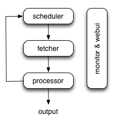

Architecture
============

This document describes the reason why I made pyspider and the architecture.

Why
---
Two years ago, I was working on a vertical search engine. We are facing following needs on crawling:

1. collect 100-200 websites, they may on/offline or change their templates at any time
> We need a really powerful monitor to find out which website is changing. And a good tool to help us write script/template for each website.

2. data should be collected in 5min when website updated
> We solve this problem by check index page frequently, and use something like 'last update time' or 'last reply time' to determine which page is changed. In addition to this, we recheck pages after X days in case to prevent the omission.  
> **pyspider will never stop as WWW is changing all the time**

Furthermore, we have some APIs from our cooperators, the API may need POST, proxy, request signature etc. Full control from script is more convenient than some global parameters of components.

Overview
--------
The following diagram shows an overview of the pyspider architecture with its components and an outline of the data flow that takes place inside the system.



Components are connected by message queue. Every component, including message queue, is running in their own process/thread, and replaceable. That means, when process is slow, you can have many instances of processor and make full use of multiple CPUs, or deploy to multiple machines. This architecture makes pyspider really fast. [benchmarking](https://gist.github.com/binux/67b276c51e988f8e2c31#comment-1339242).

Components
----------

### Scheduler
The Scheduler receives tasks from newtask_queue from processor. Decide whether the task is new or requires re-crawl. Sort tasks according to priority and feeding them to fetcher with traffic control ([token bucket](http://en.wikipedia.org/wiki/Token_bucket) algorithm). Take care of periodic tasks, lost tasks and failed tasks and retry later.

All of above can be set via `self.crawl` [API](apis/). 

Note that in current implement of scheduler, only one scheduler is allowed.

### Fetcher
The Fetcher is responsible for fetching web pages then send results to processor. For flexible, fetcher support [Data URI](http://en.wikipedia.org/wiki/Data_URI_scheme) and pages that rendered by JavaScript (via [phantomjs](http://phantomjs.org/)). Fetch method, headers, cookies, proxy, etag etc can be controlled by script via [API](apis/self.crawl/#fetch).

### Phantomjs Fetcher
Phantomjs Fetcher works like a proxy. It's connected to general Fetcher, fetch and render pages with JavaScript enabled, output a general HTML back to Fetcher:

```
scheduler -> fetcher -> processor
                |
            phantomjs
                |
             internet
```

### Processor
The Processor is responsible for running the script written by users to parse and extract information. Your script is running in an unlimited environment. Although we have various tools(like [PyQuery](https://pythonhosted.org/pyquery/)) for you to extract information and links, you can use anything you want to deal with the response. You may refer to [Script Environment](Script-Environment) and [API Reference](apis/) to get more information about script.

Processor will capture the exceptions and logs, send status(task track) and new tasks to `scheduler`, send results to `Result Worker`.

### Result Worker (optional)
Result worker receives results from `Processor`. Pyspider has a built-in result worker to save result to `resultdb`. Overwrite it to deal with result by your needs.

### WebUI
WebUI is a web frontend for everything. It contains:

* script editor, debugger
* project manager
* task monitor
* result viewer, exporter

Maybe webui is the most attractive part of pyspider. With this powerful UI, you can debug your scripts step by step just as pyspider do. Starting or stop a project. Finding which project is going wrong and what request is failed and try it again with debugger.

Data flow
---------
The data flow in pyspider is just as your seen in diagram above:

1. Each script has a callback named `on_start`, when you press the `Run` button on WebUI. A new task of `on_start` is submitted to Scheduler as the entries of project.
2. Scheduler dispatches this `on_start` task with a Data URI as a normal task to Fetcher.
3. Fetcher makes a request and a response to it (for Data URI, it's a fake request and response, but has no difference with other normal tasks), then feeds to Processor.
4. Processor calls the `on_start` method and generated some new URL to crawl. Processor send a message to Scheduler that this task is finished and new tasks via message queue to Scheduler (here is no results for `on_start` in most case. If has results, Processor send them to `result_queue`).
5. Scheduler receives the new tasks, looking up in the database, determine whether the task is new or requires re-crawl, if so, put them into task queue. Dispatch tasks in order.
6. The process repeats (from step 3) and wouldn't stop till WWW is dead ;-). Scheduler will check periodic tasks to crawl latest data.
