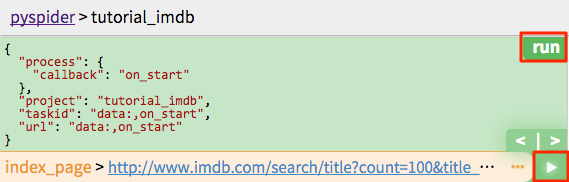
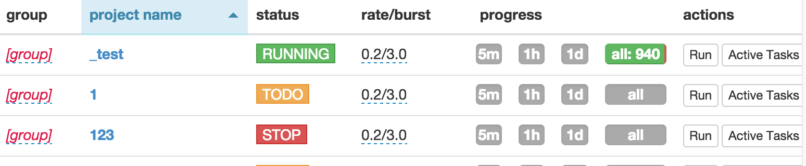

Quickstart
==========

Installation
------------

* `pip install pyspider`
* run command `pyspider`, visit [http://localhost:5000/](http://localhost:5000/)

if you are using ubuntu, try:
```
apt-get install python python-dev python-distribute python-pip \
libcurl4-openssl-dev libxml2-dev libxslt1-dev python-lxml
```
to install binary packages first.


please install PhantomJS if needed: http://phantomjs.org/build.html

note that PhantomJS will be enabled only if it is excutable in the `PATH` or in the System Environment

**Note:** `pyspider` command is running pyspider in `all` mode, which running components in threads or subprocesses. For production environment, please refer to [Deployment](Deployment).

Your First Script
-----------------

```python
from pyspider.libs.base_handler import *


class Handler(BaseHandler):
    crawl_config = {
    }

    @every(minutes=24 * 60)
    def on_start(self):
        self.crawl('http://scrapy.org/', callback=self.index_page)

    @config(age=10 * 24 * 60 * 60)
    def index_page(self, response):
        for each in response.doc('a[href^="http"]').items():
            self.crawl(each.attr.href, callback=self.detail_page)

    @config(priority=2)
    def detail_page(self, response):
        return {
            "url": response.url,
            "title": response.doc('title').text(),
        }
```

> * `def on_start(self)` is the entry point of the script. It will be called when you click the `run` button on dashboard.
> * [`self.crawl(url, callback=self.index_page)`*](/apis/self.crawl) is the most important API here. It will add a new task to be crawled.
> * `def index_page(self, response)` get a [`Response`*](/apis/Response) object. [`response.doc`*](/apis/Response/#responsedoc) is a [pyquery](https://pythonhosted.org/pyquery/) object which has jQuery-like API to select elements to be extracted.
> * `def detail_page(self, response)` return a `dict` object as result. The result will be captured into `resultdb` by default. You can override `on_result(self, result)` method to manage the result yourself.


More things you may want to know:

> * [`@every(minutes=24*60, seconds=0)`*](/apis/@every/) is a helper to tell the scheduler that `on_start` method should be called everyday.
> * [`@config(age=10 * 24 * 60 * 60)`*](/apis/self.crawl/#configkwargs) tell scheduler discard the request if it have been crawled in 10 days. The parameter [`age`*](/apis/self.crawl/#schedule) can also be specified via `self.crawl(url, age=10*24*60*60)` and `crawl_config`
> * [`@config(priority=2)`*](/apis/self.crawl/#schedule) mark that detail pages should be crawled first.

You can test your script step by step by click the green `run` button. Switch to `follows` panel, click the play button to move on.



Start Running
-------------

1. Save your script.
2. Back to dashboard find your project.
3. Changing the `status` to `DEBUG` or `RUNNING`.
4. Click the `run` button.



Your script is running now!
