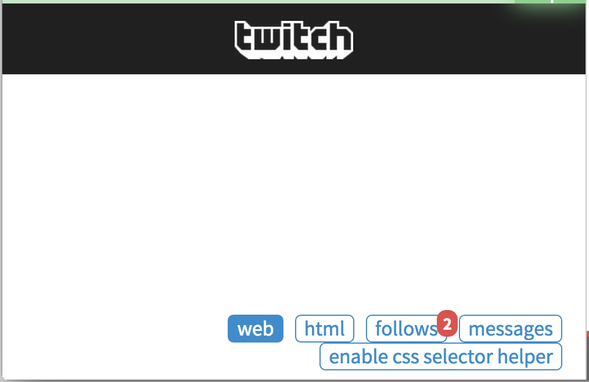
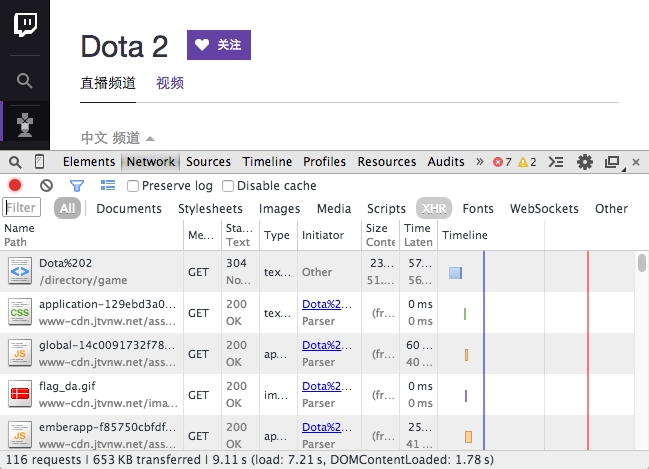
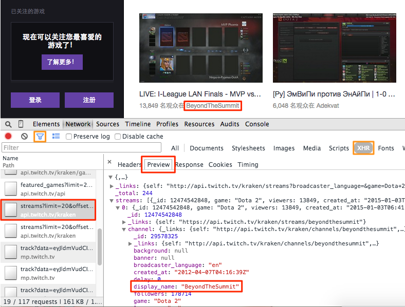
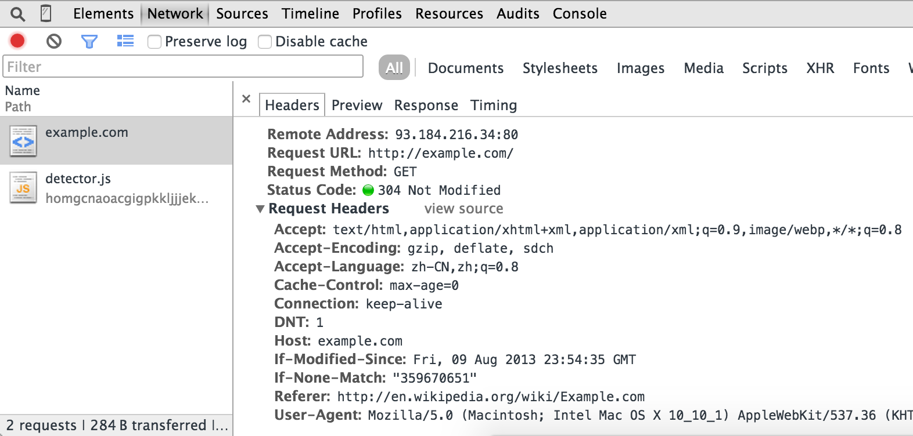

Level 2: AJAX and More HTTP
===========================

In the last article, we discussed how to extract links and information from HTML documents. However, web contents are becoming more complicated using some technology like AJAX. You may find that page looks different with it in browser, the information you want to extract is not in the HTML of the page.

In this article, we will not write complete scrape scripts, but some snippets of web page cases using the technology like AJAX or needs some HTTP parameters besides URL.

AJAX
----

[AJAX] is short for asynchronous JavaScript + XML. AJAX is using existing standards to update parts of a web page without loading the whole page. A common usage of AJAX is loading [JSON] data and render to HTML on the client side.

You may find elements missing in HTML fetched by pyspider or [wget](https://www.gnu.org/software/wget/). When you open it in browser some elements appear after page loaded with(maybe not) a 'loading' animation or words. For example, we want to scrape all channels of Dota 2 from [http://www.twitch.tv/directory/game/Dota%202](http://www.twitch.tv/directory/game/Dota%202)



But you may find nothing in the page. 

### Finding the request

As [AJAX] data is transferred in [HTTP], we can find the real request with the help of [Chrome Developer Tools](https://developer.chrome.com/devtools).

0. Open a new tab.
1. Use `Ctrl`+`Shift`+`I` (or `Cmd`+`Opt`+`I` on Mac) to open the DevTools.
2. Switch to Network panel.
3. Open the URL [http://www.twitch.tv/directory/game/Dota%202](http://www.twitch.tv/directory/game/Dota%202) in this tab.

While resources are been loaded, you may find a table of requested resources.



AJAX is using [XMLHttpRequest](https://developer.mozilla.org/en-US/docs/Web/API/XMLHttpRequest) object to send and retrieve data which is generally shorted as "XHR". Use Filter (funnel icon) to filter out the XHR requests. Glance over each requests using preview:



To determine which one is the key request, you can use a filter to reduce the number of requests, guess the usage of the request by this path and parameters, then view the response contents for confirmation. Here we found the request: [http://api.twitch.tv/kraken/streams?limit=20&offset=0&game=Dota+2&broadcaster_language=&on_site=1](http://api.twitch.tv/kraken/streams?limit=20&offset=0&game=Dota+2&broadcaster_language=&on_site=1)

Now, open the URL in a new tab, you would see a [JSON] data containing channel list. You can use a extension [JSONView](https://chrome.google.com/webstore/detail/jsonview/chklaanhfefbnpoihckbnefhakgolnmc) ([for Firfox](http://jsonview.com/)) to have a pretty printed view of JSON. A sample code is trying extract the name, current title and viewers of each channel.

```
class Handler(BaseHandler):
    @every(minutes=10)
    def on_start(self):
        self.crawl('http://api.twitch.tv/kraken/streams?limit=20&offset=0&game=Dota+2&broadcaster_language=&on_site=1', callback=self.index_page)

    @config(age=10*60)
    def index_page(self, response):
        return [{
                "name": x['channel']['display_name'],
                "viewers": x['viewers'],
                "status": x['channel'].get('status'),
             } for x in response.json['streams']]
```

> * You can use `response.json` to convert content to a python `dict` object.
> * As channel list is changing frequently, we update it every 10 minutes and use [`@config(age=10*60)`](/apis/self.crawl/#configkwargs) to set the age. Otherwise, it will be ignored as scheduler thinks it's new enough and refuse to update the content.

Here is an online demo for twitch as well as a measure using [PhantomJS] which will be discussed in the next level: [http://demo.pyspider.org/debug/tutorial_twitch](http://demo.pyspider.org/debug/tutorial_twitch)

HTTP
----

[HTTP] is the protocol to exchange or transfer hypertext. We had used it in last article, we used `self.crawl` and a URL to fetch HTML content which is transferred by [HTTP].

When you got `403 Forbidden` or needed login. You need right parameters of HTTP request.

A typical HTTP request message to [http://example.com/](http://example.com/) looks like:

```
GET / HTTP/1.1
Host: example.com
Connection: keep-alive
Cache-Control: max-age=0
Accept: text/html,application/xhtml+xml,application/xml;q=0.9,image/webp,*/*;q=0.8
User-Agent: Mozilla/5.0 (Macintosh; Intel Mac OS X 10_10_1) AppleWebKit/537.36 (KHTML, like Gecko) Chrome/40.0.2214.45 Safari/537.36
Referer: http://en.wikipedia.org/wiki/Example.com
Accept-Encoding: gzip, deflate, sdch
Accept-Language: zh-CN,zh;q=0.8
If-None-Match: "359670651"
If-Modified-Since: Fri, 09 Aug 2013 23:54:35 GMT
```

> * the first line contains [HTTP method](http://www.w3schools.com/tags/ref_httpmethods.asp), path and HTTP version
> * several lines of request header fields in `key: value` format.
> * if has message body(say POST request), an empty line and message body would be appended to end of request message.

You can get this with [Chrome Developer Tools](https://developer.chrome.com/devtools) - Network panel we used in above section:



In most case, the last thing you need is to copy right URL + method + headers + body from Network panel.

cURL command
------------

`self.crawl` supports `cURL` command as argument to make the HTTP request. It will parse the arguments in the command and use it as fetch parameters.

With `Copy as cURL` of a request, you can get a `cURL` command and paste to `self.crawl(command)` to make crawling easy.

HTTP Method
-----------

[HTTP] defines methods to indicate the desired action to be performed on the identified resource. Two commonly used methods are: GET and POST. GET is when you open a URL, requests the content of a specified resource. POST is used to submit data to server.

TODO: need example here.

HTTP Headers
------------

[HTTP Headers](http://en.wikipedia.org/wiki/List_of_HTTP_header_fields) is a list of parameters of a request. Some headers you need to attention while scraping:

### User-Agent

A [user agent string](http://en.wikipedia.org/wiki/User_agent_string) tell server the application type, operating system or software revision who send the HTTP request.

pyspider's default user agent string is: `pyspider/VERSION (+http://pyspider.org/)`

### Referer

[Referer](http://en.wikipedia.org/wiki/HTTP_referer) is the address of the previous webpage from which a link to the currently requested page was followed. Some website uses this in image resources to prevent deep linking.

TODO: need example here.

HTTP Cookie
-----------

[HTTP Cookie](http://en.wikipedia.org/wiki/HTTP_cookie) is a field in HTTP headers used for tracking which user is making the request. Generally used for user login and prevent unauthorized requests.

You can use [`self.crawl(cookies={"key": value})`](/apis/self.crawl/#fetch) to set cookie via a dict like API.

TODO: need example here.

[PhantomJS]:           http://phantomjs.org/
[AJAX]:          http://en.wikipedia.org/wiki/Ajax_%28programming%29
[JSON]:          http://en.wikipedia.org/wiki/JSON
[HTTP]:          http://en.wikipedia.org/wiki/Hypertext_Transfer_Protocol
