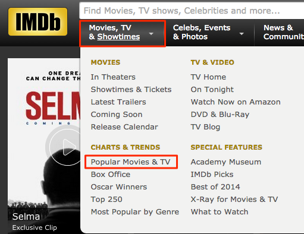
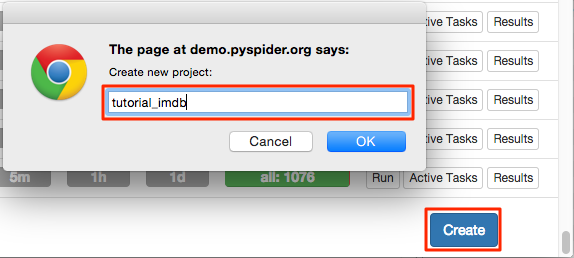
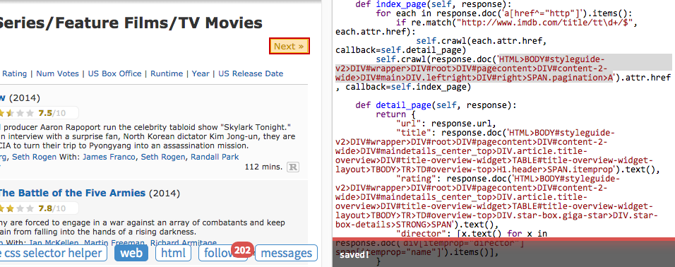
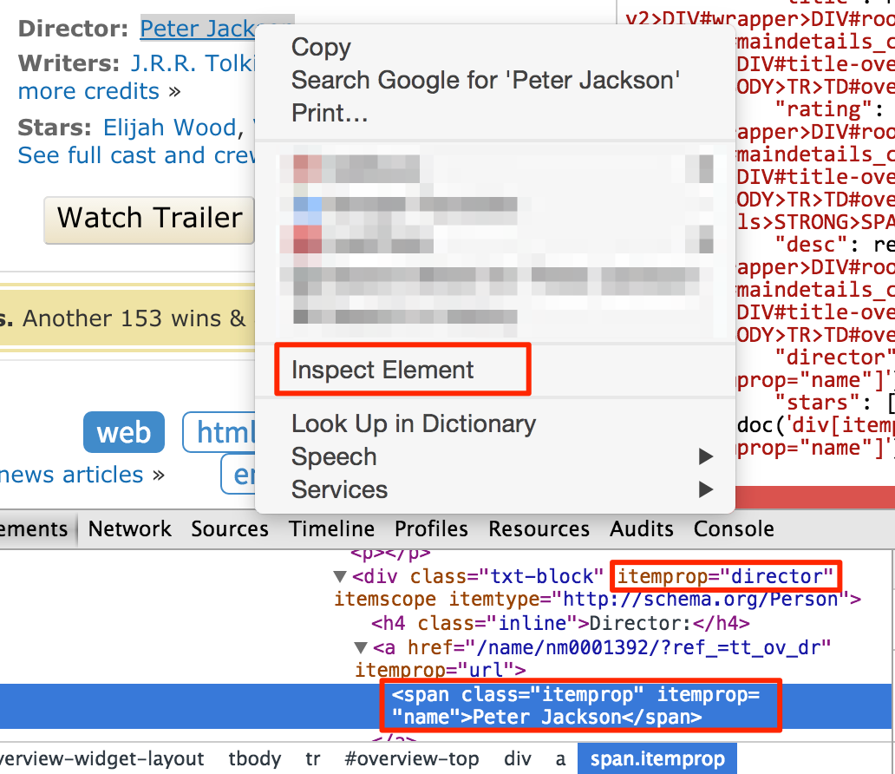

Level 1: HTML and CSS Selector
==============================

In this tutorial, we will scrape information of movies and TV from [IMDb].

An online demo with completed code is: [http://demo.pyspider.org/debug/tutorial_imdb](http://demo.pyspider.org/debug/tutorial_imdb) .


Before Start
------------

You should have pyspider installed. You can refer to the documentation [QuickStart](Quickstart). Or test your code on [demo.pyspider.org](http://demo.pyspider.org).

Some basic knowledges you should know before scraping:

* [Web][WWW] is a system of interlinked hypertext pages.
* Pages is identified on the Web via uniform resource locator ([URL]).
* Pages transferred via the Hypertext Transfer Protocol ([HTTP]).
* Web Pages structured using HyperText Markup Language ([HTML]).

To scrape information from a web is

1. Finding URLs of the pages contain the information we want.
2. Fetching the pages via HTTP.
3. Extracting the information from HTML.
4. Finding more URL contains what we want, go back to 2.


Pick a start URL
----------------

As we want to get all of the movies on [IMDb], the first thing is finding a list.  A good list page may:

* containing links to the [movies](http://www.imdb.com/title/tt0167260/) as many as possible.
* by following next page, you can traverse all of the movies. 
* list sorted by last updated time would be a great help to get latest movies.

By looking around at the index page of [IMDb], I found this:



[http://www.imdb.com/search/title?count=100&title_type=feature,tv_series,tv_movie&ref_=nv_ch_mm_1](http://www.imdb.com/search/title?count=100&title_type=feature,tv_series,tv_movie&ref_=nv_ch_mm_1)

### Creating a project

You can find "Create" on the bottom right of baseboard. Click and name a project.



Changing the crawl URL in `on_start` callback:

```
    @every(minutes=24 * 60)
    def on_start(self):
        self.crawl('http://www.imdb.com/search/title?count=100&title_type=feature,tv_series,tv_movie&ref_=nv_ch_mm_1', callback=self.index_page)
```

> * `self.crawl` would fetch the page and call the `callback` method to parse the response.  
> * The [`@every` decorator](http://docs.pyspider.org/en/latest/apis/@every/) represents `on_start` would execute every day, to make sure not missing any new movies.

Click the green `run` button, you should find a red 1 above follows, switch to follows panel, click the green play button:


Index Page
----------

From [index page](http://www.imdb.com/search/title?count=100&title_type=feature,tv_series,tv_movie&ref_=nv_ch_mm_1), we need extract two things:

* links of the movies like `http://www.imdb.com/title/tt0167260/`
* links of [Next](http://www.imdb.com/search/title?count=100&ref_=nv_ch_mm_1&start=101&title_type=feature,tv_series,tv_movie) page

### Find Movies

As you can see, the sample handler had already extracted 1900+ links from the page. A measure of extracting movie pages is filtering links with regular expression:

```
import re
...

    def index_page(self, response):
        for each in response.doc('a[href^="http"]').items():
            if re.match("http://www.imdb.com/title/tt\d+/$", each.attr.href):
                self.crawl(each.attr.href, callback=self.detail_page)
```

> * `callback` is `self.detail_page` here to use another callback method to parse.

Remember you can always use the power of python or anything you are familiar with to extract information. But using tools like CSS selector is recommended.

### Next page

#### CSS Selectors

CSS selectors are patterns used by [CSS] to select HTML elements which are wanted to style. As elements containing information may have different style in document, It's appropriate to use CSS Selector to select elements we want. More information about CSS selectors could be found in above links:

* [CSS Selectors](http://www.w3schools.com/css/css_selectors.asp)
* [CSS Selector Reference](http://www.w3schools.com/cssref/css_selectors.asp)

You can use CSS Selector with built-in `response.doc` object, which is provided by [PyQuery], you may find the full reference there.

#### CSS Selector Helper

pyspider provide a tool called `CSS selector helper` to make it easier to generate a selector pattern to element you clicked. Enable CSS selector helper by click the button and switch to `web` panel.



The element will be highlighted in yellow while mouse over. When you click it, a pre-selected CSS Selector pattern is shown on the bar above. You can edit the features to locate the element and add it to your source code.

click "Next »" in the page and add selector pattern to your code:

```
    def index_page(self, response):
        for each in response.doc('a[href^="http"]').items():
            if re.match("http://www.imdb.com/title/tt\d+/$", each.attr.href):
                self.crawl(each.attr.href, callback=self.detail_page)
        self.crawl(response.doc('#right a').attr.href, callback=self.index_page)
```

Click `run` again and move to the next page, we found that "« Prev" has the same selector pattern as "Next »". When using above code you may find pyspider selected the link of "« Prev", not "Next »". A solution for this is select both of them:

```
        self.crawl([x.attr.href for x in response.doc('#right a').items()], callback=self.index_page)
```

Extracting Information
----------------------

Click `run` again and follow to detail page.

Add keys you need to result dict and collect value using `CSS selector helper` repeatedly:

```
    def detail_page(self, response):
        return {
            "url": response.url,
            "title": response.doc('.header > [itemprop="name"]').text(),
            "rating": response.doc('.star-box-giga-star').text(),
            "director": [x.text() for x in response.doc('[itemprop="director"] span').items()],
        }
```

Note that, `CSS Selector helper` may not always work. You could write selector pattern manually with tools like [Chrome Dev Tools](https://developer.chrome.com/devtools):



You doesn't need to write every ancestral element in selector pattern, only the elements which can differentiate with not needed elements, is enough. However, it needs experience on scraping or Web developing to know which attribute is important, can be used as locator. You can also test CSS Selector in the JavaScript Console by using `$$` like `$$('[itemprop="director"] span')`

Running
-------

1. After tested you code, don't forget to save it.
2. Back to dashboard find your project.
3. Changing the `status` to `DEBUG` or `RUNNING`.
4. Press the `run` button. 


Notes
-----

The script is just a simple, you may found more issues when scraping IMDb:

* ref in list page url is for tracing user, it's better remove it.
* IMDb does not serve more than 100000 results for any query, you need find more lists with lesser results, like [this](http://www.imdb.com/search/title?genres=action&title_type=feature&sort=moviemeter,asc)
* You may need a list sorted by last updated time and update it with a shorter interval.
* Some attribute is hard to extract, you may need write selector pattern on hand or using [XPATH](http://www.w3schools.com/xpath/xpath_syntax.asp) and/or some python code to extract information.

[IMDb]:          http://www.imdb.com/
[WWW]:           http://en.wikipedia.org/wiki/World_Wide_Web
[HTTP]:          http://en.wikipedia.org/wiki/Hypertext_Transfer_Protocol
[HTML]:          http://en.wikipedia.org/wiki/HTML
[URL]:           http://en.wikipedia.org/wiki/Uniform_resource_locator
[CSS]:           https://developer.mozilla.org/en-US/docs/Web/Guide/CSS/Getting_Started/What_is_CSS
[PyQuery]:       https://pythonhosted.org/pyquery/
